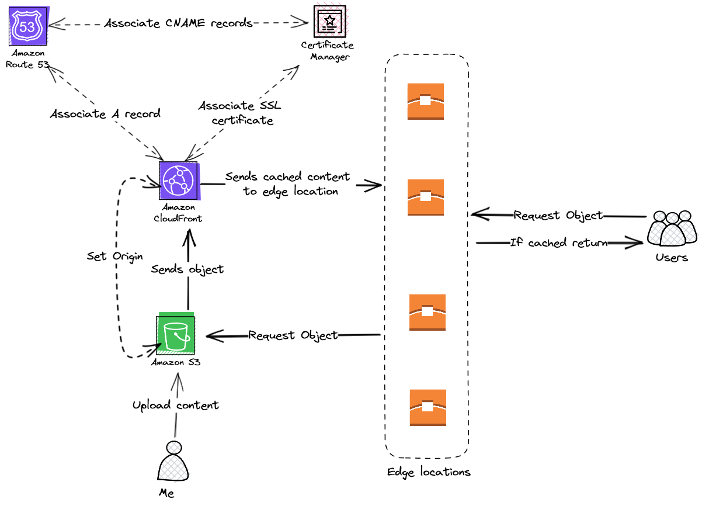

## My site

This is my website, I used GatsbyJS which is a static site generator

It is hosted with AWS Infrastructure, here is a diagram on how it works

- [x] Make it mobile friendly
- [ ] Update the navigation between pages
- [ ] Add navigation between categories